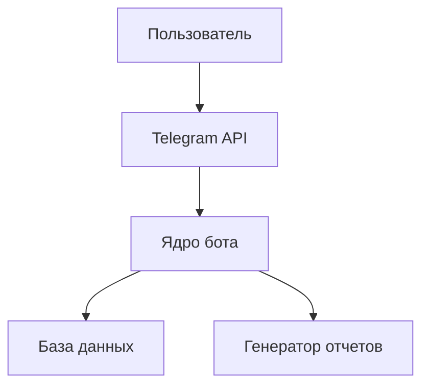
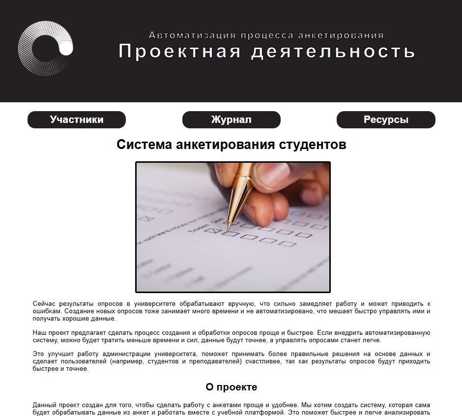

# Документация по проектной (учебной) практике

## Общая информация
**Сроки выполнения:** 03.02.2025 - 24.05.2025  
**Студенты:** Атаев М., Шувалов Д.И.
**Руководитель:** Рябчикова А.В.

## Цели практики
1. Научиться документировать проекты
2. Получить опыт создания статических сайтов
3. Освоить разработку Telegram-ботов на Python

## Часть 1: Разработка статического сайта

### Этапы разработки
**Технологический стек:**
- HTML5
- CSS3

**Структура сайта:**
```HTML
<!DOCTYPE html>
<html>
<head>
    <title>Автоматизация процесса анкетирования</title>
    <link rel="stylesheet" href="styles.css">
</head>
<body>
    <header>...</header>
    <nav>...</nav>
    <main>...</main>
    <footer>...</footer>
</body>
</html>
```

**Процесс создания:**

Процесс разработки статического сайта проходил при взаимодействии двух студентов в течение 3 дней, где каждый отвечал за определенную часть. Работа началась с совместного обсуждения реализации будущего сайта, где мы определили его структуру и оформление. После утверждения общего видения, мы разделили обязанности: Шувалов Д. взял на себя создание главной страницы, а Атаев М. занялся разработкой второстепенных разделов.

Разработка главной страницы началась с создания базового HTML-каркаса, включающего шапку сайта с навигационным меню, основное содержание и подвал. Особое внимание уделялось созданию адаптивной верстки, чтобы сайт корректно отображался на устройствах с разными размерами экранов. Для этого использовалась комбинация Flexbox и Grid Layout, что позволило создать гибкую структуру, автоматически подстраивающуюся под параметры устройства пользователя. Оформление сайта было стилизовано с помощью CSS.

После создания главной страницы Атаев М. начал работу над второстепенными страницами: "Участники", "Журнал" и "Ресурсы". Шувалов Д. собрал информацию о проекте "Автоматизация процесса анкетирования" и передал ее своему коллеге, после чего Атаев М. заполнил страницы собранной информацией. Особенностью нашего взаимодействия стало постоянное согласование стилей и структуры.

Результатом проделанной работы стал полностью работоспособный статический веб-сайт с продуманным пользовательским интерфейсом и согласованным дизайном всех разделов. 


## Часть 2: Разработка Telegram-бота

### Этапы разработки

**Проектирование архитектуры:**

**Процесс создания:**

Разработка нашего финансового бота велась на протяжении двух недель. Мы сознательно выбрали парное программирование, чтобы совместить наши компетенции — Шувалов Д. отвечал за backend-логику и работу с базой данных, а Атаев М. сосредоточился на frontend-части: интерфейсе бота и UX.

Мы начали с совместного проектирования архитектуры в Miro, где набросали: Схему взаимодействия модулей, диаграмму базы данных, пользовательские сценарии. Далее мы приступили к разработке бота. Каждое утро мы созванивались в Discord, где распределяли задачи на день. Шувалов Д. работал над созданием базы данных, а Атаев М. занимался созданием интерфейса. Он смог разработать систему контекстных кнопок, которые динамически менялись в зависимости от состояния диалога, что упрощает ввод комманд. Самым сложным этапом было соединение наших кодов. 

После этого мы приступили к тестированию. Добавление доходов, расходов и отчет прошли успешное тестирование, а в статистике не отправлялось изображение, поэтому потребовалось исправить ошибки. После тестирования работа над ботом была завершена.

**Реализация бота:**

Инициализация базы данных:
```python
def _init_db(self):
        """Инициализирует базу данных и создает таблицы при необходимости"""
        with sqlite3.connect(self.db_file) as conn:
            cursor = conn.cursor()
            cursor.execute("""
                CREATE TABLE IF NOT EXISTS transactions (
                    id INTEGER PRIMARY KEY AUTOINCREMENT,
                    user_id INTEGER NOT NULL,
                    type TEXT NOT NULL,
                    category TEXT NOT NULL,
                    amount REAL NOT NULL,
                    date TIMESTAMP NOT NULL,
                    description TEXT
                )
            """)
            conn.commit()
```
Добавление кнопок:
```python
@bot.message_handler(func=lambda m: m.text == '➕ Добавить доход')
def add_income_button(message):
    add_income(message)

@bot.message_handler(func=lambda m: m.text == '➖ Добавить расход')
def add_expense_button(message):
    add_expense(message)

@bot.message_handler(func=lambda m: m.text == '📊 Статистика')
def stats_button(message):
    stats_command(message)

@bot.message_handler(func=lambda m: m.text == '📝 Отчёт')
def report_button(message):
    report_command(message)

@bot.message_handler(func=lambda m: m.text == '📋 История')
def history_button(message):
    history_command(message)

@bot.message_handler(func=lambda m: m.text == 'ℹ️ Помощь')
def help_button(message):
    start(message)

@bot.callback_query_handler(func=lambda call: True)
def callback_handler(call: types.CallbackQuery):
    """Обработчик нажатий на кнопки"""
    user_id = call.from_user.id
    data = call.data

    if data.startswith(('expense_', 'income_')):
        transaction_type, category = data.split('_', 1)
        user_data[user_id]['state'] = 'awaiting_amount'
        user_data[user_id]['category'] = category

        bot.edit_message_text(
            f"📌 Категория: {category}\n\nВведите сумму:",
            call.message.chat.id,
            call.message.message_id
        )

    elif data.startswith('stats_'):
        period = data.split('_')[1]
        show_statistics(call, user_id, period)

    elif data.startswith('report_'):
        period = data.split('_')[1]
        show_report(call, user_id, period)

```
## Итоги
В ходе разработки проекта мы успешно освоили комплекс современных технологий для создания Telegram-ботов. Основой нашего решения стала библиотека pyTelegramBotAPI, которая предоставила удобный инструментарий для работы с Telegram API и реализации интерактивного взаимодействия с пользователями. Для хранения финансовых данных мы интегрировали SQLite — легковесную, но мощную реляционную базу данных, позволяющую эффективно организовать структурированное хранение транзакций и пользовательских профилей. Особое внимание уделили аналитике: с помощью библиотеки Matplotlib мы реализовали систему визуализации финансовой статистики, которая автоматически генерирует наглядные круговые диаграммы и графики динамики расходов.

Параллельно с разработкой бота мы научились создавать адаптивные статические веб-страницы с семантической версткой, используя современные технологии CSS — Flexbox и Grid Layout. Это позволило нам строить сложные интерфейсы, которые корректно отображаются на устройствах с любым разрешением экрана.

## Приложения
**Скриншоты интерфейсов:**

  

*Рис. 1. главная страница статического сайта*


  

*Рис. 2. меню бота*

**Полезные ресурсы:**

[Создание telegram-бота на Python](https://www.freecodecamp.org/news/how-to-create-a-telegram-bot-using-python/)

[Документация pyTelegramBotAPI](https://github.com/eternnoir/pyTelegramBotAPI)

[Руководство по SQlite](https://www.sqlite.org/docs.html)

[Примеры matplotlib](https://matplotlib.org/stable/gallery/index.html)

[Введение в css верстку](https://developer.mozilla.org/ru/docs/Learn_web_development/Core/CSS_layout/Introduction)

[Элементы HTML](https://developer.mozilla.org/ru/docs/Web/HTML/Element)

[Основы HTML](https://developer.mozilla.org/ru/docs/Learn_web_development/Getting_started/Your_first_website/Creating_the_content)

[Основы CSS](https://developer.mozilla.org/ru/docs/Web/CSS)
