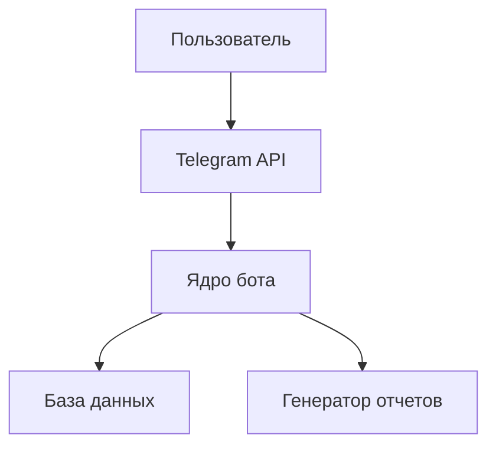

# Документация по проектной (учебной) практике

## Общая информация
**Сроки выполнения:** 03.02.2025 - 24.05.2025  
**Студенты:** Атаев М., Шувалов Д.И.
**Руководитель:** Рябчикова А.В.

## Цели практики
1. Научиться документировать проекты
2. Получить опыт создания статических сайтов
3. Освоить разработку Telegram-ботов на Python

## Часть 1: Разработка статического сайта

### Этапы разработки
**Технологический стек:**
- HTML5
- CSS3

**Структура сайта:**
```HTML
<!DOCTYPE html>
<html>
<head>
    <title>Автоматизация процесса анкетирования</title>
    <link rel="stylesheet" href="styles.css">
</head>
<body>
    <header>...</header>
    <nav>...</nav>
    <main>...</main>
    <footer>...</footer>
</body>
</html>
```

**Макет сайта:**

  

*Рис. 1. макет статического сайта*

**Процесс создания:**

Процесс разработки статического сайта проходил при взаимодействии двух студентов в течение 3 дней, где каждый отвечал за определенную часть. Работа началась с совместного обсуждения реализации будущего сайта, где мы определили его структуру и оформление. После утверждения общего видения, мы разделили обязанности: Шувалов Д. взял на себя создание главной страницы, а Атаев М. занялся разработкой второстепенных разделов.

Разработка главной страницы началась с создания базового HTML-каркаса, включающего шапку сайта с навигационным меню, основное содержание и подвал. Особое внимание уделялось созданию адаптивной верстки, чтобы сайт корректно отображался на устройствах с разными размерами экранов. Для этого использовалась комбинация Flexbox и Grid Layout, что позволило создать гибкую структуру, автоматически подстраивающуюся под параметры устройства пользователя. Оформление сайта было стилизовано с помощью CSS.

После создания главной страницы Атаев М. начал работу над второстепенными страницами: "Участники", "Журнал" и "Ресурсы". Шувалов Д. собрал информацию о проекте "Автоматизация процесса анкетирования" и передал ее своему коллеге, после чего Атаев М. заполнил страницы собранной информацией. Особенностью нашего взаимодействия стало постоянное согласование стилей и структуры.

Результатом проделанной работы стал полностью работоспособный статический веб-сайт с продуманным пользовательским интерфейсом и согласованным дизайном всех разделов. 


## Часть 2: Разработка Telegram-бота

### Этапы разработки

**Проектирование архитектуры:**

**Процесс создания:**

Разработка нашего финансового бота велась на протяжении двух недель. Мы сознательно выбрали парное программирование, чтобы совместить наши компетенции — Шувалов Д. отвечал за backend-логику и работу с базой данных, а Атаев М. сосредоточился на frontend-части: интерфейсе бота и UX.

Мы начали с совместного проектирования архитектуры в Miro, где набросали: Схему взаимодействия модулей, диаграмму базы данных, пользовательские сценарии. Далее мы приступили к разработке бота. Каждое утро мы созванивались в Discord, где распределяли задачи на день. Шувалов Д. работал над созданием базы данных, а Атаев М. занимался созданием интерфейса. Он смог разработать систему контекстных кнопок, которые динамически менялись в зависимости от состояния диалога, что упрощает ввод комманд. Самым сложным этапом было соединение наших кодов. 

После этого мы приступили к тестированию. Добавление доходов, расходов и отчет прошли успешное тестирование, а в статистике не отправлялось изображение, поэтому потребовалось исправить ошибки. После тестирования работа над ботом была завершена.

**Реализация бота:**

Инициализация базы данных:
```python
def _init_db(self):
        """Инициализирует базу данных и создает таблицы при необходимости"""
        with sqlite3.connect(self.db_file) as conn:
            cursor = conn.cursor()
            cursor.execute("""
                CREATE TABLE IF NOT EXISTS transactions (
                    id INTEGER PRIMARY KEY AUTOINCREMENT,
                    user_id INTEGER NOT NULL,
                    type TEXT NOT NULL,
                    category TEXT NOT NULL,
                    amount REAL NOT NULL,
                    date TIMESTAMP NOT NULL,
                    description TEXT
                )
            """)
            conn.commit()
```
Визуализация данных:
```python
def plot_statistics(self, user_id: int, period: str = 'week') -> Optional[str]:
        """Создает и сохраняет график статистики"""
        stats = self.get_statistics(user_id, period)
        
        # Проверяем наличие данных
        if not stats['expenses_by_category'] and not stats['income_by_category']:
            return None

        plt.switch_backend('Agg')  # Важно для работы в некоторых окружениях
        plt.style.use('ggplot')
        
        # Создаем фигуру
        fig, (ax1, ax2) = plt.subplots(1, 2, figsize=(12, 6))
        fig.suptitle(f"Статистика за {self._get_period_name(period)}")
        
        # График расходов
        if stats['expenses_by_category']:
            expenses = stats['expenses_by_category']
            ax1.pie(
                expenses.values(),
                labels=expenses.keys(),
                autopct=lambda p: f'{p:.1f}%\n({p*sum(expenses.values())/100:.2f} ₽)',
                startangle=90
            )
            ax1.set_title('Расходы')
        
        # График доходов
        if stats['income_by_category']:
            income = stats['income_by_category']
            ax2.pie(
                income.values(),
                labels=income.keys(),
                autopct=lambda p: f'{p:.1f}%\n({p*sum(income.values())/100:.2f} ₽)',
                startangle=90
            )
            ax2.set_title('Доходы')
        
        plt.tight_layout()
        
        # Сохраняем в временный файл
        filename = f"chart_{user_id}_{datetime.now().strftime('%Y%m%d%H%M%S')}.png"
        plt.savefig(filename, dpi=100, bbox_inches='tight')
        plt.close()
        
        return filename
```
