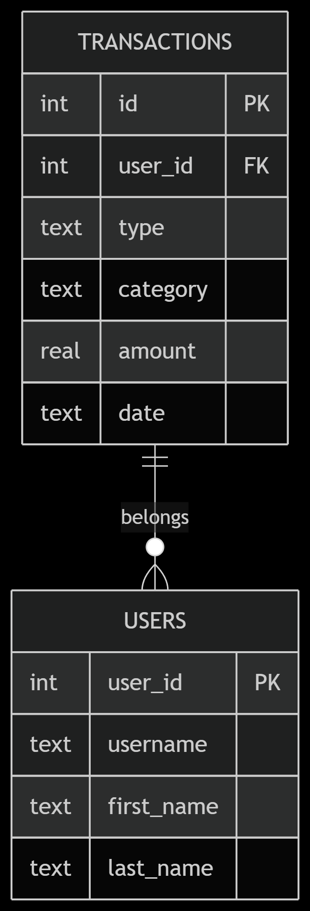
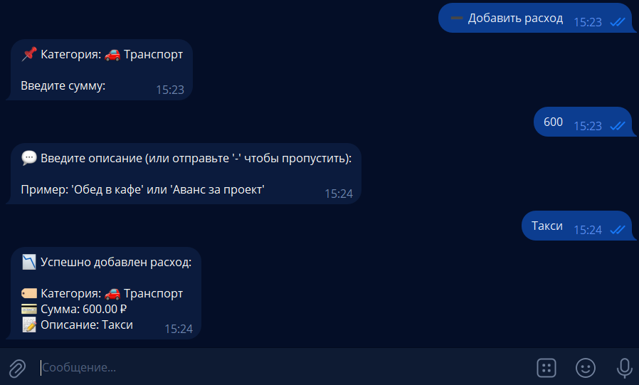
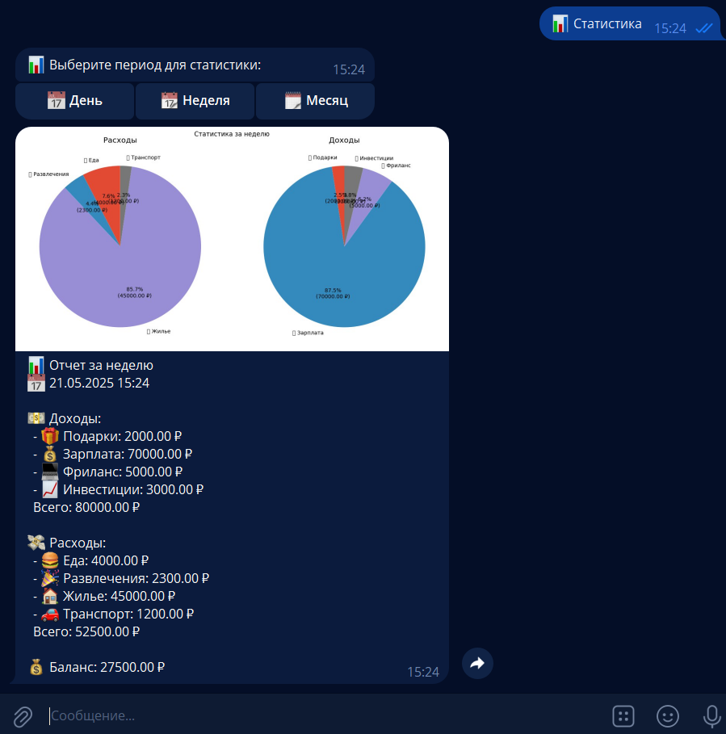

# Полное руководство по созданию финансового Telegram-бота с SQLite

## Содержание
1. [Исследование предметной области](#исследование-предметной-области)
2. [Техническое руководство](#техническое-руководство)
   - [Подготовка окружения](#1-подготовка-окружения)
   - [Настройка базы данных](#2-настройка-базы-данных)
   - [Реализация функций](#3-реализация-основных-функций)
   - [Развертывание](#4-развертывание-бота)
3. [Примеры работы](#-примеры-работы-бота)
4. [Архитектура](#-архитектура-приложения)
5. [Ресурсы](#-полезные-ресурсы)

## 🔍 Исследование предметной области

### Анализ потребностей
**Цель:** Создание бота для автоматизации учета личных финансов  
**Целевая аудитория:** Физические лица, фрилансеры, семьи  

**Ключевые функции:**
- Ведение учета доходов/расходов
- Категоризация операций
- Визуализация статистики
- Гибкая система отчетности

## 🛠 Техническое руководство

### 1. Подготовка окружения

**Установка зависимостей:**
```bash
pip install pyTelegramBotAPI matplotlib pandas  
```
**Структура проекта**
```bash
finance-bot/
├── main.py
├── financial_data.db
├── link.txt
└── requirements.txt
```
### 2. Настройка базы данных
**Схема БД:**



*Рис. 1. Схема базы данных*

**Инициализация базы данных:**
```python
def _init_db(self):
        """Инициализирует базу данных и создает таблицы при необходимости"""
        with sqlite3.connect(self.db_file) as conn:
            cursor = conn.cursor()
            cursor.execute("""
                CREATE TABLE IF NOT EXISTS transactions (
                    id INTEGER PRIMARY KEY AUTOINCREMENT,
                    user_id INTEGER NOT NULL,
                    type TEXT NOT NULL,
                    category TEXT NOT NULL,
                    amount REAL NOT NULL,
                    date TIMESTAMP NOT NULL,
                    description TEXT
                )
            """)
            conn.commit()
```
### 3. Реализация основных функций
**Добавление операции:**
```python
def add_expense(message):
    """Добавление расхода """
    user_id = message.from_user.id
    user_data[user_id] = {'state': 'awaiting_category', 'type': 'expense'}
    
    markup = types.InlineKeyboardMarkup(row_width=2)
    buttons = [types.InlineKeyboardButton(cat, callback_data=f"expense_{cat}") 
              for cat in DEFAULT_CATEGORIES['expense']]
    markup.add(*buttons)
    
    bot.send_message(
        message.chat.id, 
        "📉 Выберите категорию расхода:", 
        reply_markup=markup
    )
```
**Визуализация данных:**
```python
def plot_statistics(self, user_id: int, period: str = 'week') -> Optional[str]:
        """Создает и сохраняет график статистики"""
        stats = self.get_statistics(user_id, period)
        
        # Проверяем наличие данных
        if not stats['expenses_by_category'] and not stats['income_by_category']:
            return None

        plt.switch_backend('Agg')  # Важно для работы в некоторых окружениях
        plt.style.use('ggplot')
        
        # Создаем фигуру
        fig, (ax1, ax2) = plt.subplots(1, 2, figsize=(12, 6))
        fig.suptitle(f"Статистика за {self._get_period_name(period)}")
        
        # График расходов
        if stats['expenses_by_category']:
            expenses = stats['expenses_by_category']
            ax1.pie(
                expenses.values(),
                labels=expenses.keys(),
                autopct=lambda p: f'{p:.1f}%\n({p*sum(expenses.values())/100:.2f} ₽)',
                startangle=90
            )
            ax1.set_title('Расходы')
        
        # График доходов
        if stats['income_by_category']:
            income = stats['income_by_category']
            ax2.pie(
                income.values(),
                labels=income.keys(),
                autopct=lambda p: f'{p:.1f}%\n({p*sum(income.values())/100:.2f} ₽)',
                startangle=90
            )
            ax2.set_title('Доходы')
        
        plt.tight_layout()
        
        # Сохраняем в временный файл
        filename = f"chart_{user_id}_{datetime.now().strftime('%Y%m%d%H%M%S')}.png"
        plt.savefig(filename, dpi=100, bbox_inches='tight')
        plt.close()
        
        return filename
```
### 4. Развертывание бота
**Последовательность действий:**
1. Получить токен у @BotFather
2. Настроить конфигурацию:
   ```python
   TOKEN = 'Токен'
   DB_FILE = 'financial_data.db'
   ```
3. Запустить бота:
   ```python
   python bot.py
   ```
## Примеры работы бота
**Главное меню:**


*Рис. 2. Интерфейс главного меню*

**Добавление расхода:**



*Рис. 3. Демонстрация добавления расходов*

**Статистика:**



*Рис. 4. Выведение статистики*

## Архитектура бота
